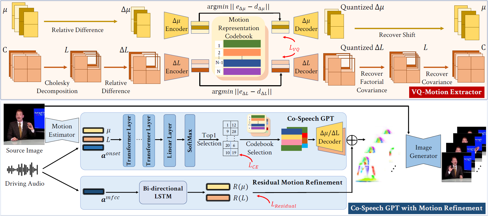
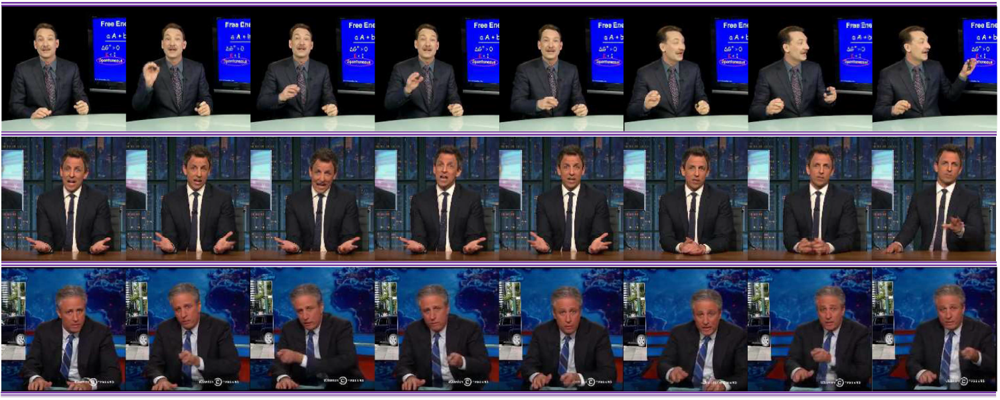
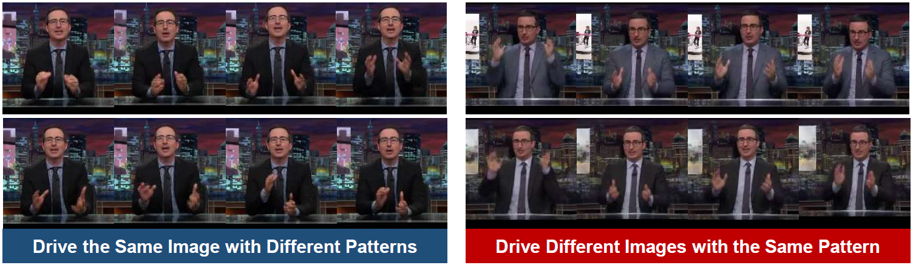

# Audio-Driven Co-Speech Gesture Video Generation (NeurIPS 2022)

[Xian Liu](https://alvinliu0.github.io/), [Qianyi Wu](https://wuqianyi.top/), [Hang Zhou](https://hangz-nju-cuhk.github.io/), [Yuanqi Du](https://yuanqidu.github.io/), [Wayne Wu](https://wywu.github.io/), [Dahua Lin](http://dahua.site/), [Ziwei Liu](https://liuziwei7.github.io/).

### [Project](https://alvinliu0.github.io/projects/ANGIE) | [Paper](https://arxiv.org/pdf/2203.13161.pdf) | [Demo](https://www.youtube.com/watch?v=tVclrexHqhs) | [Data (Coming Soon)](https://alvinliu0.github.io/projects/ANGIE)

Animating high-fidelity video portrait with speech audio is crucial for virtual reality and digital entertainment. While most previous studies rely on accurate explicit structural information, recent works explore the implicit scene representation of Neural Radiance Fields (NeRF) for realistic generation. In order to capture the inconsistent motions as well as the semantic difference between human head and torso, some work models them via two individual sets of NeRF, leading to unnatural results. In this work, we propose Semantic-aware Speaking Portrait NeRF (SSP-NeRF), which creates delicate audio-driven portraits using one unified set of NeRF. The proposed model can handle the detailed local facial semantics and the global head-torso relationship through two semantic-aware modules. Specifically, we first propose a Semantic-Aware Dynamic Ray Sampling module with an additional parsing branch that facilitates audio-driven volume rendering. Moreover, to enable portrait rendering in one unified neural radiance field, a Torso Deformation module is designed to stabilize the large-scale non-rigid torso motions. Extensive evaluations demonstrate that our proposed approach renders realistic video portraits.



## Results

Qualitative image sequence results on the PATS Image dataset:



Visualization of codebook entries that correspond to motion patterns:



## Citation

If you find our work useful, please kindly cite as:
```
@article{liu2022audio,
    title={Audio-Driven Co-Speech Gesture Video Generation},
    author={Liu, Xian and Wu, Qianyi and Zhou, Hang and Du, Yuanqi and Wu, Wayne and Lin, Dahua and Liu, Ziwei},
    journal={Advances in Neural Information Processing Systems},
    year={2022}
}
```

## Related Projects

If you are interested in **Audio/Speech Driven Co-Speech Gesture Generation**, we would also like to recommend you to check out other related works:

* Learning Hierarchical Cross-Modal Association for Co-Speech Gesture Generation: [CVPR 2022] [HA2G](https://alvinliu0.github.io/projects/HA2G).